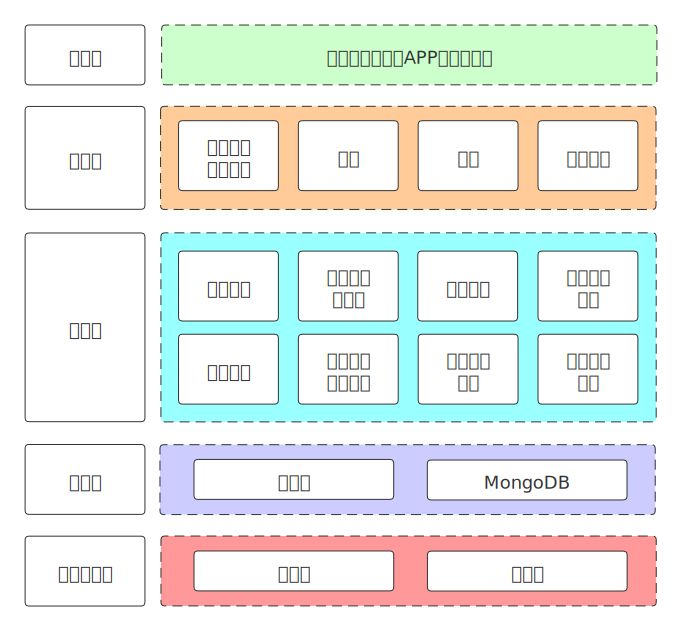

# 逻辑架构

自上而下分为五层:
- **呈现层**是系统最终呈现给用户的形式；
- **用户层**是该系统的使用对象，是数据的生产者和消费者，包括“学习者”“各级给类教育机构”和“社企组织”；
- **应用层**是系统所提供给用户的功能，是对数据的整合记录与再创造，主要包括发布、参与项目，学习成果的记录、认证、查询与验证；
- **数据层**和**云基础设施**为整个系统搭建并提供了一个可信且智能的基础设施环境，包括华为链、数据库和云服务设施，对于需要存储的可信数据，例如如学习成果证书和学习记录，需要上链存储以达到防篡改可追溯的目的，而对于其他部分数据，如课程项目的描述、内容等，可以放至数据库中存储。